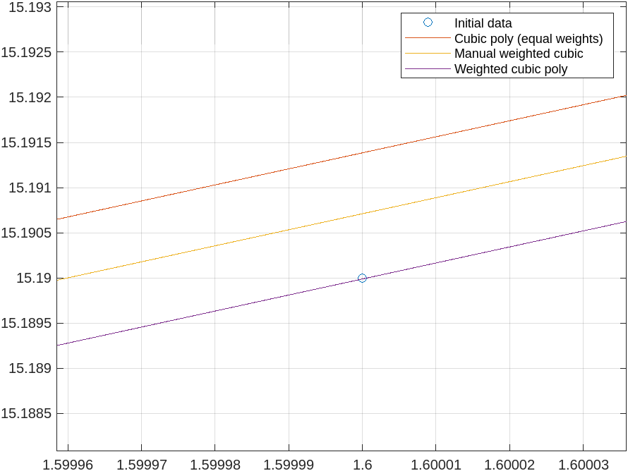

# Sisukord
- [Sissejuhatus](#sissejuhatus)
- [Kokkuvõte](#kokkuvõte)
  - [Esialgne võrrandisüsteem](#vorrandisysteem)
  - [Funktsioonide võrdlus](#funktsioonide-võrdlus)
- [Täpsem vähimruutude meetod erinevate kaalude korral](#tapsem)
  - [Esimene küsimus](#esimenekysimus)
- [Alternatiivsed lahendusviisid](#alternatiivsed-lahendusviisid)
  - [SVD-teisendus](#svd-teisendus)
  - [Cholesky-teisendus](#cholesky-teisendus)


# Sissejuhatus
Tere!

Mul tekkis paar küsimust seoses viimase kodutööga, kus oli vaja lähendada anutud väärtused vähimruutude meetodi abil **kuuppolünoomiga**:
```
x = [1.2   1.3   1.4  1.5   1.6   1.7   1.8   1.9   2];
y = [9.08 10.43 11.9 13.48 15.19 17.03 19.01 21.13 23.39];
k = [1     1     2    5     1     4     2     2     1];
```

Ma olen allpool koostanud igaks juhuks väikse kokkuvõtte sellest, kuidas ma seda probleemi lahendasin. Kui see osa huvi ei paku, võib hüpata kohe mu esimese küsimuse juurde, mis on [siin](#esimenekysimus).

## Kokkuvõte
<a id="vorrandisysteem"></a>
### Esialgne võrrandisüsteem
Meil oli vaja lahendada probleem kujul

$$
A_k \cdot \mathbf{c} = b_k,
$$

kus:
- $A_k$ on maatriks elementidega $(A_k)_{ij} = \sum \kappa x^{i+j}$,
- $\mathbf{c} = \begin{bmatrix} c_0 & c_1 & c_2 & c_3 \end{bmatrix}^\top$ on koefitsentide vektor,
- $b_k$ on vektor kompnentidega $(b_k)_i = \sum \kappa y x^i$.

ehk 

$$
\begin{bmatrix}
\sum \kappa x^6 & \sum \kappa x^5 & \sum \kappa x^4 & \sum \kappa x^3 \\
\sum \kappa x^5 & \sum \kappa x^4 & \sum \kappa x^3 & \sum \kappa x^2 \\
\sum \kappa x^4 & \sum \kappa x^3 & \sum \kappa x^2 & \sum \kappa x^1 \\
\sum \kappa x^3 & \sum \kappa x^2 & \sum \kappa x^1 & \sum \kappa x^0
\end{bmatrix} \cdot
\begin{bmatrix}
c_0 \\
c_1 \\
c_2 \\
c_3 
\end{bmatrix} = 
\begin{bmatrix}
\sum \kappa y x^3 \\
\sum \kappa y x^2 \\
\sum \kappa y x^1 \\
\sum \kappa y x^0
\end{bmatrix}
$$

Üks küsimus, mis tunnis lahtiseks jäi oli see kuidas saaks $A$ maatriksi kompaktsel `for` tsüklite abil kirja panna. Mu stateegia oli täita maatriksi elemendid ridade kaupa, vasakult paremale. Selle peamine küsimus seisnes selles kuidas genereerida iga $A$ elemendi jaoks õige aste. Kirjutades need astmed välja häi mulle silma selline muster:
```
% Esimene rida
6 - 0 - 0 = 6
6 - 1 - 0 = 5
6 - 2 - 0 = 4
6 - 3 - 0 = 3
% Teine rida
6 - 0 - 1 = 5
6 - 1 - 1 = 4
6 - 2 - 1 = 3
6 - 3 - 1 = 2
...
6 - (j-1) - (i-1) = N   % i - reategur; j - veerutegur; N - aste

6 - (j-1) - (i-1) = N => 8 - i - j = N 
```

Siinkohal jäi see `8`  mulle silma kuna ta oleks täpselt $2 \cdot M$ teguriga võrdne, kus $M$ on tundmatute tegurite arv või $X$ vektori pikkus ehk 4. Seega võimaldus mul kirja panna selline kahekordne `for` tsükkel:

```
% Lahendame süsteemi kujul A*X = B
N = 3;          % Polünoomi aste
M = N+1;        % Tundmatute arv
A = zeros(M,M);
B = zeros(M,1);
for i = 1:M
    B(i, 1) = sum(k.*y.*x.^(M - i));
    for j = 1:M
        A(i,j) = sum( k.*x.^( 2*M - i - j ) );
    end
end
X = A^(-1) * B  % Vastus ehk polünoomi kordajate väärtused
```

### Funktsioonide võrdlus

Võrdluse mõttes lahendasin selle probleemi kolmel viisil. 

Esimene oli kuuppolünoomiga, millel on võrdsed kaalud ehk
```
% p = polyfit(x, y, 3)
p =

    0.8923    2.2464    3.7054   -0.1427 
```

Teine oli lahendatud erinevate kaaludega ehk selle kahekordse for-tsükli abiga, mis andis vastuseks
```
X = 
    0.9121
    2.1622
    3.8204
   -0.1931
```

Viimaseks läksin ma internetist uurima, kas keegi on juhuslikult teinud mingi oma funktsiooni, mis võtaks sisse andmed, kaalud ja astme ning annaks vastu polünoomi kordajad. Leidsin vastuse siit MathWorksi foorumist: [
polyfitweighted](https://se.mathworks.com/matlabcentral/fileexchange/13520-polyfitweighted)

Esialgu kui ma seda funktsiooni vaatasin tundus ta kuidagi kahtalselt pikk ning kordajad mis ta andis erinesid kergelt teisest meetodist 
```
X_qr = polyfitweighted(x,y,3,k)
X_qr =

   0.9331
   3.9309
  -0.2376
   2.0766
```

Kasutades kõike kolme meetodit sain ma graafiku, mida teile täna näitasin:


Ehk punane joon on tavaline võrdsete kaaludega meetod, kollane see võrrandisüsteem kaaludega ja viimane, lilla, on koostatud selle internetist leitud `polyfitweighted()` funktsiooni abil. 

Siinkohal hakkasin siis uurima, miks ja kuidas see `polyfitweighted()` antud andmeid nii ilusti läbib. Funkstiooni uurides leidsin järgmised asjad.

<a id="tapsem"></a>
## Täpsem vähimruutute meetod erinevate kaalude korral

Esialgu on vajalik `x` väärtuste põhjal koostada Vandermonde maatriks ehk 
```
Vtemp = vander(x)
Vtemp =

     4.2998     3.5832     2.9860     2.4883     2.0736     1.7280     1.4400     1.2000     1.0000
     8.1573     6.2749     4.8268     3.7129     2.8561     2.1970     1.6900     1.3000     1.0000
    14.7579    10.5414     7.5295     5.3782     3.8416     2.7440     1.9600     1.4000     1.0000
    25.6289    17.0859    11.3906     7.5938     5.0625     3.3750     2.2500     1.5000     1.0000
    42.9497    26.8435    16.7772    10.4858     6.5536     4.0960     2.5600     1.6000     1.0000
    69.7576    41.0339    24.1376    14.1986     8.3521     4.9130     2.8900     1.7000     1.0000
   110.1996    61.2220    34.0122    18.8957    10.4976     5.8320     3.2400     1.8000     1.0000
   169.8356    89.3872    47.0459    24.7610    13.0321     6.8590     3.6100     1.9000     1.0000
   256.0000   128.0000    64.0000    32.0000    16.0000     8.0000     4.0000     2.0000     1.0000
```

Kuna meil on tegemist kuuppolünoomiga, siis on sellest maatriksist vaja välja võtta ainult 4 viimast tulpa ning korrutada need on vaja korrutada läbi vastavate kaalude elementidega ehk kasutada `.* k'`. Seega järgmiseks tuli teha
```
N = 3;
V = Vtemp(:, (length(Vtemp) - N):length(Vtemp)) .* k'
V =

    1.7280    1.4400    1.2000    1.0000
    2.1970    1.6900    1.3000    1.0000
    5.4880    3.9200    2.8000    2.0000
   16.8750   11.2500    7.5000    5.0000
    4.0960    2.5600    1.6000    1.0000
   19.6520   11.5600    6.8000    4.0000
   11.6640    6.4800    3.6000    2.0000
   13.7180    7.2200    3.8000    2.0000
    8.0000    4.0000    2.0000    1.0000
```

Nüüd on vaja lahendada probleem kujul $V \cdot X = B$. Kuna $V$ maatriksi mõõtmed on hetkel [$9 \times 4$], siis ei saa pöördmaatriksit leida. Selle lahendamiseks rakendab `polyfitweighted()` autor $V$-maatrkisile $QR$-teisendust (või kas parem on öelda $QR$-lahutus?) 

```
% Meetod 1:
[Q,R] = qr(V,0);        % MathWorks dokumentatsiooni kohaselt on see halb viis
X_qr = R\(Q'*(w.*y));   % vastus

% Meetod 2:
[Q,R,p] = qr(V, "econ", "vector")   % MathWorksi poolt soovitatud süntaks
X_qr(p,:) = R\(Q \ (k .* y)')       % vastus
```
Ehk siis hakatakse süsteemi lahendama sellisel kujul
$$
Q \cdot R \cdot X = B
$$

Vaadadest seda koodi, kuidas X vektor leitakse, peab valem olema selline
$$
X = R^{-1} \cdot (Q^T \cdot (\kappa \odot y)^T)
$$

<a id="esimenekysimus"></a>
### Esimene küsimus

Siit tuleb minu esimene küsimus: 

### <ins>**Miks on see valem sellisel kujul?**<ins>

Nii palju kui ma aru saan siis $B = \kappa \odot y$. Miks pole seal vaja arvestada enam üldse $x$ väärtusetega nagu [siin](#vorrandisysteem).

Kokkuvõte kogu koodist:
```
x = [1.2   1.3   1.4  1.5   1.6   1.7   1.8   1.9   2];
y = [9.08 10.43 11.9 13.48 15.19 17.03 19.01 21.13 23.39];
k = [1     1     2    5     1     4     2     2     1];
N = 3;
Vtemp = vander(x);
V = Vtemp(:, (length(Vtemp) - N):length(Vtemp)) .* k'
[Q,R] = qr(V, 0) 
X_qr = R\(Q \ (k .* y)')
```

---

## Alternatiivsed lahendusviisid

### SVD-teisendus

Pärast selle lahendamist tekkis mul endal isiklik huvi kas on olemas veel mingeid teisendusi, mis aitaks lahendada antud probleemi. Olin kuulnud sellisest asjad nagu SVD-teisendus (Singe Value Decomposition). Leidsin, et sellega on samuti võimalik see probleem ära lahendada järgmise koodiga:
```
% L*D*R * X = (k .* y)'
fprintf("Lahendus SVD-teisendusega\n")
[L, D, R] = svd(V);
fprintf("L (vasakpoolsed singulaarvektorid) %dx%d\n", size(L,1), size(L,2))
disp(L)
fprintf("D (singulaarväärtuste diagonaalmaatriks) %dx%d\n", size(D,1), size(D,2)) 
disp(D)
fprintf("R (parempoolsed singulaarvektorid) %dx%d\n", size(R,1), size(R,2))
disp(R)
ky = (k .* y)';    % kaaludega parempoolne vektor
fprintf("Kaaludega parempoolne vektor %dx%d\n", size(ky,1), size(ky,2))
disp(ky)

% Pseudo-pöördmaatriks D või D†
D_pseudo_inv = pinv(D);

% Pikem viis teha sama
%D_pseudo_inv = zeros(size(D'));
%for i = 1:min(size(D))
%    if D(i, i) > eps                  % Väldi nulliga jagamist
%        D_pseudo_inv(i, i) = 1 / D(i, i);
%    end
%end

% X = R ⋅ D† ⋅ L^T ⋅ ky
% Lahendus
X_svd = R * D_pseudo_inv * (L' * ky);
fprintf("X_svd = \n"); disp(X_svd);
```

Kui ma seda käsitsi tegin siis ma sain vastuseks 
$$
X = R \cdot D^{-1} \cdot L^T \cdot (\kappa \odot y)^T
$$

aga internetist uurides tuli välja, et õige vastus on hoopis 
$$
X = R \cdot D^{\dagger} \cdot L^T \cdot (\kappa \odot y)^T
$$

Siinkohal mu teine küsimus:
### <ins>**Miks ja millal vaja leida $D^{\dagger}$ mitte $D^{-1}$?**<ins>

---

### Cholesky teisendus

Viimane variant, mida ma veel proovisin oli Cholesky teisendus, millel oli kõige imelikum lahenduskäik
```
fprintf("Lahendus Cholesky teisenduse abil\n");
% Koosta kaalutud maatriksid
W = diag(k);                % Diagonaalmaatriks kaaludega
A = V' * W * V;             % Normaalmaatriks (sümmeetriline ja positiivne definitsiooniga)
b = V' * W * (k.*y)';       % Kaalutud vektor
fprintf("W (Diagonaalmaatriks kaaludega) %dx%d\n", size(W,1), size(W,2))
disp(W)
fprintf("A (sümmeetriline ja positiivne Vandermonde maatriks) %dx%d\n", size(A,1), size(A,2)) 
disp(A)
fprintf("b (Kaalutud vektor) %dx%d\n", size(b,1), size(b,2))
disp(b)

% Cholesky teisendus maatriksile A
R = chol(A);                % Cholesky teisendus, A = R' * R
fprintf("Cholesky teisenduse tulemus A = R^T * R:\nR = \n")
disp(R)

% Lahendus kahes etapis: edasi- ja tagasisubstitutsioon
y_temp = R' \ b;            % Lahenda y_temp = (R^T)^-1 * b
X_chol = R \ y_temp;        % Lahenda X = R^-1 * y

% Kuva tulemus
fprintf("Lõpptulemus:\nX_chol = \n")
disp(X_chol);
```

Esimene asi mis mulle silma jäi oli $A$-maatriksi ja $b$-vektori koostamine $A \cdot x = b$ süsteemi lahendamise jaoks:
$$
A = V^T \cdot W \cdot V; 
$$
$$
b = V^T \cdot W \cdot (k \odot y)^T
$$

Siit minu kolmas ja viimane küsimus:
### <ins>**Miks on just selline rakendus oluline?**<ins>